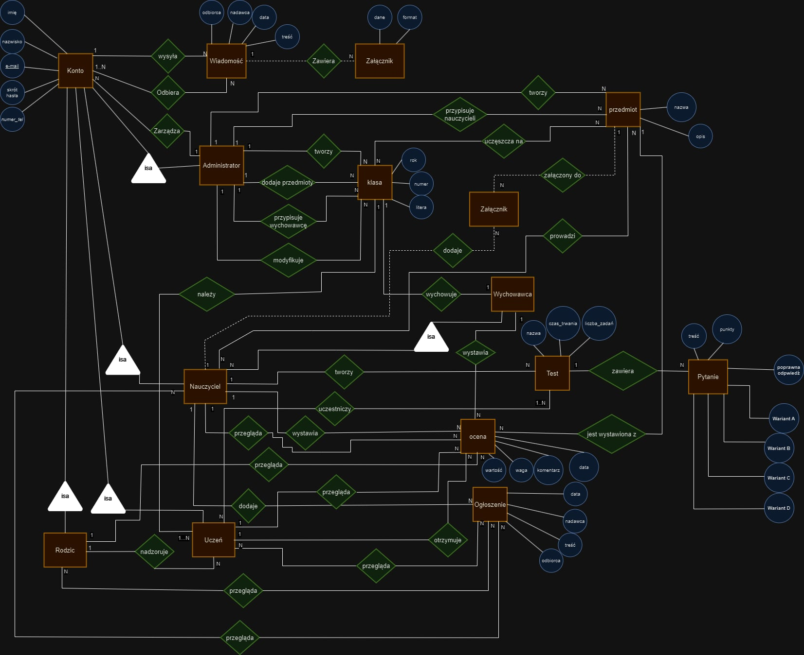
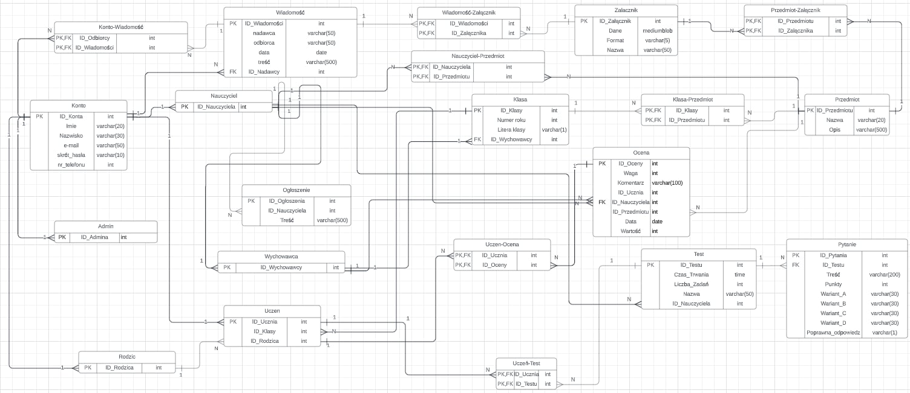

# Brutus

Aplikacja **Brutus** to wirtualny dziennik internetowy stworzony w .NET, C# o architekturze MVC.  
Przeznaczony dla nauczycieli, uczniów i rodziców; zarządzany przez administratora.
Baza danych – MSSQL
EFCore, ASP.NET Core

Model koncepcyjny bazy danych - diagram ER

Schemat relacyjny bazy danych

[Dokumentacja dostępna tutaj.](Dokumentacja_Brutus.pdf)

---------------------------------------------------------------------------------------------------

# Brutus

**The Brutus** application is a virtual online diary created in .NET, C# with MVC architecture.  
Designed for teachers, students, and parents; managed by an administrator.

Conceptual database model - ER diagram (polish)

Relational database schema (polish)

[Documentation available here (polish).](Dokumentacja_Brutus.pdf)
